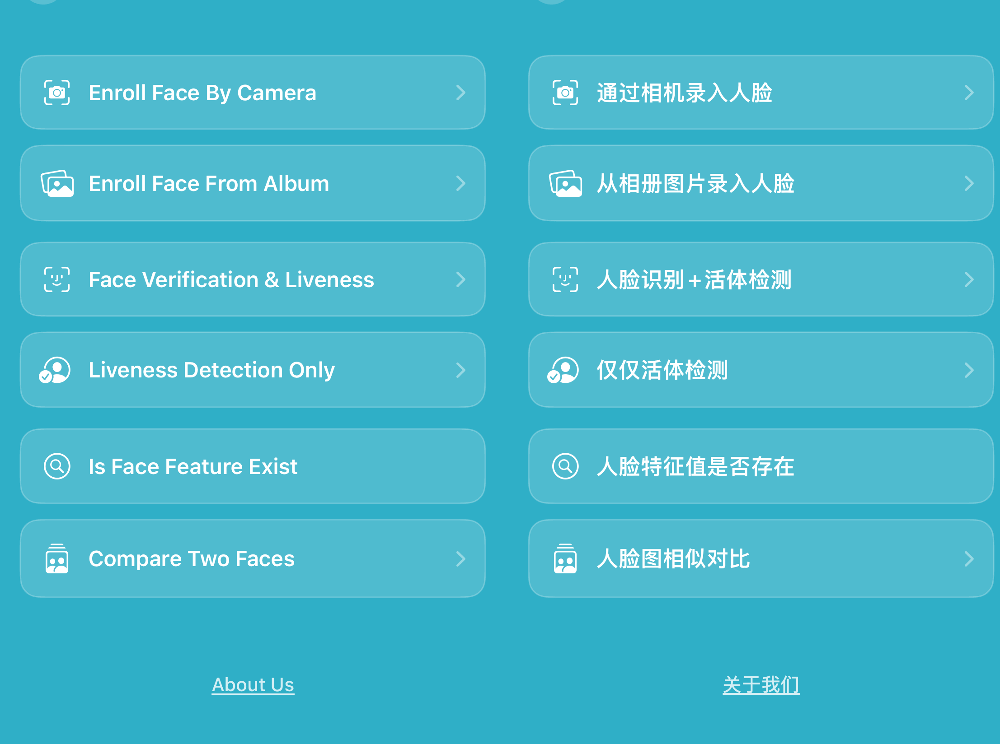

# face_recognition_flutter

[](https://pub.dev/packages/face_recognition_flutter)
[](#platform-support)

Offline face recognition and liveness detection Flutter plugin for Android and iOS. Built for FaceAISDK, it supports face enrollment, 1:1 face verification, liveness detection, and local face feature management.



## Features

- Offline face enrollment from SDK camera or Base64 image.
- 1:1 face verification with action, color, and silent liveness detection.
- Liveness-only detection for real-person checks.
- Local face feature query, insert, delete, and face image export.
- Built-in native UI plus direct Flutter API calls.

## Platform Support

| Platform | Minimum Version | Camera Enrollment | Image Enrollment | Face Verify | Liveness |
| --- | --- | --- | --- | --- | --- |
| Android | minSdk 21 | Yes | Yes | Yes | Yes |
| iOS | 15.5 | Yes | Yes | Yes | Yes |

## Installation

```bash
flutter pub add face_recognition_flutter
```

### Android

Add camera permission:

```xml
<uses-permission android:name="android.permission.CAMERA" />
```

Make sure `minSdkVersion` is at least `21`.

### iOS

Add camera usage text to `Info.plist`:

```xml
<key>NSCameraUsageDescription</key>
<string>FaceAISDK needs camera access for face enrollment and liveness verification.</string>
```

Make sure the iOS deployment target is at least `15.5`.

## Quick Start

```dart
import 'package:face_recognition_flutter/face_recognition_flutter.dart';

final result = await FaceRecognitionFlutter.faceVerify(
  faceId: 'user_001',
  threshold: 0.84,
  livenessType: 1,
  motionLivenessTypes: '1,2,3,4,5',
);

if (result.isSuccess) {
  print('Verified: ${result.similarity}');
}
```

## Common APIs

```dart
// Enroll by SDK camera.
await FaceRecognitionFlutter.addFaceBySDKCamera(faceId: 'user_001');

// Enroll by Base64 image.
await FaceRecognitionFlutter.addFaceBySDKImage(
  faceId: 'user_001',
  imageBase64: 'data:image/jpeg;base64,...',
);

// Liveness only.
await FaceRecognitionFlutter.livenessVerify(livenessType: 2);

// Face feature management.
await FaceRecognitionFlutter.getFaceFeature('user_001');
await FaceRecognitionFlutter.insertFaceFeature(faceId: 'user_001', feature: '...');
await FaceRecognitionFlutter.deleteFaceFeature('user_001');
```

## Run the Example

This is a Flutter plugin. Run the demo from the `example` app:

```bash
cd example
flutter run
```

If you run from the plugin root, specify the target:

```bash
flutter run -t example/lib/main.dart
```

## Result Codes

| Code | Constant | Meaning |
| --- | --- | --- |
| 0 | `DEFAULT` | Initial state; the flow has not started yet |
| 1 | `VERIFY_SUCCESS` | 1:1 face verification passed; similarity is higher than the configured threshold |
| 2 | `VERIFY_FAILED` | 1:1 face verification failed; similarity is lower than the configured threshold |
| 3 | `MOTION_LIVENESS_SUCCESS` | Motion liveness passed; the SDK may continue to the next step automatically |
| 4 | `MOTION_LIVENESS_TIMEOUT` | Motion liveness timed out |
| 5 | `NO_FACE_MULTI` | Face detection failed several times in a row |
| 6 | `NO_FACE_FEATURE` | No valid face feature was detected or extracted |
| 7 | `COLOR_LIVENESS_SUCCESS` | Color liveness passed |
| 8 | `COLOR_LIVENESS_FAILED` | Color liveness failed |
| 9 | `COLOR_LIVENESS_LIGHT_TOO_HIGH` | Color liveness failed because ambient light is too bright |
| 10 | `ALL_LIVENESS_SUCCESS` | All liveness steps passed, including motion and color liveness |
| 11 | `SILENT_LIVENESS_FAILED` | Silent liveness failed |
| 12 | `NO_BASE_FACE_FEATURE` | No registered base face feature exists locally |
| 13 | `NOT_ALLOW_MULTI_FACES` | Multiple faces appeared in the camera frame |

## Troubleshooting

- `Target file "lib/main.dart" not found`: run `cd example && flutter run`.
- iOS cannot find Swift demo views: run `cd example/ios && pod install`.
- Android Studio shows no devices while CLI works: restart adb with `adb kill-server && adb start-server`, then restart Android Studio.
- iOS simulator arm64 warnings may come from transitive MLKit/TensorFlowLite dependencies; use a real iOS device when needed.

## Related SDKs

- [FaceAISDK iOS](https://github.com/FaceAISDK/FaceAISDK_iOS)
- [FaceAISDK Android](https://github.com/FaceAISDK/FaceAISDK_Android)
- [FaceAISDK Flutter](https://github.com/FaceAISDK/face_recognition_flutter)
- [FaceAISDK React Native](https://github.com/FaceAISDK/FaceRecognition_ReactNative)

---

# face_recognition_flutter 中文说明

适用于 Android 和 iOS 的 FaceAISDK 离线人脸识别 Flutter 插件，支持人脸录入、1:1 人脸核验、活体检测和本地人脸特征管理。

## 功能

- 通过 SDK 相机或 Base64 图片录入人脸。
- 支持动作、炫彩、静默活体检测。
- 支持 1:1 人脸识别 + 活体检测。
- 支持查询、同步、删除本地人脸特征值。
- 支持原生内置 UI 和 Flutter API 直接调用。

## 平台支持

| 平台 | 最低版本 | 相机录入 | 图片录入 | 人脸核验 | 活体检测 |
| --- | --- | --- | --- | --- | --- |
| Android | minSdk 21 | 支持 | 支持 | 支持 | 支持 |
| iOS | 15.5 | 支持 | 支持 | 支持 | 支持 |

## 安装

```bash
flutter pub add face_recognition_flutter
```

Android 添加相机权限：

```xml
<uses-permission android:name="android.permission.CAMERA" />
```

iOS 在 `Info.plist` 添加：

```xml
<key>NSCameraUsageDescription</key>
<string>FaceAISDK needs camera access for face enrollment and liveness verification.</string>
```

## 快速使用

```dart
import 'package:face_recognition_flutter/face_recognition_flutter.dart';

final result = await FaceRecognitionFlutter.faceVerify(
  faceId: 'user_001',
  threshold: 0.84,
  livenessType: 1,
  motionLivenessTypes: '1,2,3,4,5',
);

if (result.isSuccess) {
  print('核验成功: ${result.similarity}');
}
```

## 运行示例

```bash
cd example
flutter run
```

如果在插件根目录运行：

```bash
flutter run -t example/lib/main.dart
```

## 结果状态码

| 状态码 | 常量名 | 详细描述 |
| --- | --- | --- |
| 0 | `DEFAULT` | 初始化状态，流程尚未开始 |
| 1 | `VERIFY_SUCCESS` | 1:1 人脸比对成功，相似度高于设置的阈值 |
| 2 | `VERIFY_FAILED` | 1:1 人脸比对失败，相似度低于设置的阈值 |
| 3 | `MOTION_LIVENESS_SUCCESS` | 动作活体检测成功，通常会自动进入后续流程 |
| 4 | `MOTION_LIVENESS_TIMEOUT` | 动作活体检测超时 |
| 5 | `NO_FACE_MULTI` | 连续多次未能成功检测到人脸 |
| 6 | `NO_FACE_FEATURE` | 未检测到或无法提取有效的人脸特征值 |
| 7 | `COLOR_LIVENESS_SUCCESS` | 炫彩活体检测通过 |
| 8 | `COLOR_LIVENESS_FAILED` | 炫彩活体检测失败 |
| 9 | `COLOR_LIVENESS_LIGHT_TOO_HIGH` | 炫彩活体检测失败，环境光线亮度过高 |
| 10 | `ALL_LIVENESS_SUCCESS` | 所有活体检测环节全部完成，包含动作与炫彩 |
| 11 | `SILENT_LIVENESS_FAILED` | 静默活体检测失败 |
| 12 | `NO_BASE_FACE_FEATURE` | 本地未注册或未录入基准人脸信息 |
| 13 | `NOT_ALLOW_MULTI_FACES` | 摄像头画面中出现多张人脸 |

## 常见问题

- `Target file "lib/main.dart" not found`：请进入 `example` 目录运行。
- iOS 找不到 Swift 示例页面：执行 `cd example/ios && pod install`。
- Android Studio 看不到设备：重启 adb 和 Android Studio。
- iOS 模拟器依赖架构警告：建议使用真机验证。
