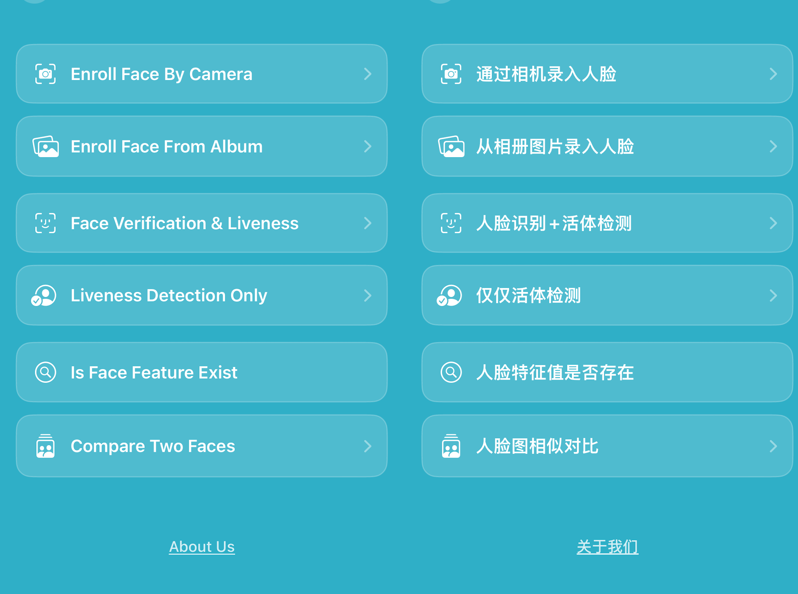

# face_recognition_flutter

<p align="center">
  <strong>English</strong> | <a href="README.zh-CN.md">简体中文</a>
</p>

[](https://pub.dev/packages/face_recognition_flutter)
[](#platform-support)

FaceAISDK's offline face recognition and liveness detection plugin for Flutter. It supports enrollment, 1:1 verification, local feature management, and native camera UI on Android and iOS.



## Features

- On-device face processing without a network connection.
- Face enrollment using the SDK camera or a Base64-encoded image.
- 1:1 face verification with a configurable similarity threshold.
- Motion, motion + color, color, and silent liveness detection.
- Local face feature query, insertion, deletion, existence checks, and image export.
- Compare two SDK-generated face features without opening the camera.
- Built-in native camera UI and an embeddable Flutter platform view.
- Native UI resources in English and Simplified Chinese.

## Platform Support

| Platform | Minimum version | Additional requirements |
| --- | --- | --- |
| Android | API 21 | `compileSdk` 34 or later; Java 17 |
| iOS | 15.5 | CocoaPods; Swift 5.9 |

> Swift Package Manager is not currently supported. Use CocoaPods for iOS integration.

## Installation

```bash
flutter pub add face_recognition_flutter
```

### Android

Add camera permission to `android/app/src/main/AndroidManifest.xml`:

```xml
<uses-permission android:name="android.permission.CAMERA" />
```

Make sure the application uses `minSdk` 21 or later and Java 17:

```kotlin
android {
    defaultConfig {
        minSdk = 21
    }

    compileOptions {
        sourceCompatibility = JavaVersion.VERSION_17
        targetCompatibility = JavaVersion.VERSION_17
    }
}
```

### iOS

Set the minimum deployment target in `ios/Podfile`:

```ruby
platform :ios, '15.5'
```

Add the FaceAISDK Core source inside the `Runner` target. Its tag must match the version required by the plugin podspec:

```ruby
target 'Runner' do
  use_frameworks!

  flutter_install_all_ios_pods File.dirname(File.realpath(__FILE__))

  pod 'FaceAISDK_Core',
      :git => 'https://github.com/FaceAISDK/FaceAISDK_Core.git',
      :tag => '2026.09.22'
end
```

Add camera usage text to `ios/Runner/Info.plist`:

```xml
<key>NSCameraUsageDescription</key>
<string>FaceAISDK needs camera access for face enrollment and liveness verification.</string>
```

Localize this permission message in your app as needed.

Install the pods:

```bash
cd ios
pod install
```

## Quick Start

### 1. Enroll a face

```dart
import 'package:face_recognition_flutter/face_recognition_flutter.dart';

final enrollment = await FaceRecognitionFlutter.addFaceBySDKCamera(
  faceId: 'user_001',
);

if (!enrollment.isSuccess) {
  print('Enrollment failed: ${enrollment.message}');
}
```

### 2. Verify the enrolled face

```dart
final result = await FaceRecognitionFlutter.faceVerify(
  faceId: 'user_001',
);

if (result.isSuccess) {
  print('Verified. Similarity: ${result.similarity}');
} else {
  print('Verification failed: ${result.message}');
}
```

## Liveness Detection

### Liveness modes

| Value | Mode | Description |
| --- | --- | --- |
| `1` | Motion | Completes one or more requested facial actions |
| `2` | Motion + color | Combines motion and screen-color liveness checks |
| `3` | Color | Uses screen-color changes; avoid very bright environments |
| `4` | Silent | Performs passive liveness detection without user actions |

### Motion actions

Pass action values as a comma-separated string, for example `"1,2,3,4,5"`.

| Value | Action |
| --- | --- |
| `1` | Open mouth |
| `2` | Smile |
| `3` | Blink |
| `4` | Shake head |
| `5` | Nod |

Validate thresholds and liveness behavior on devices used in your deployment.

Run liveness detection without 1:1 face comparison:

```dart
final result = await FaceRecognitionFlutter.livenessVerify(
  livenessType: 4,
);
```

## API Reference

All methods are asynchronous. Optional parameters and platform differences are documented in the Dart API.

| API | Description | Result |
| --- | --- | --- |
| `addFaceBySDKCamera` | Enrolls a face using the native SDK camera | `FaceRecognitionResult` |
| `addFaceBySDKImage` | Enrolls a face from a Base64-encoded image | `FaceRecognitionResult` |
| `faceVerify` | Runs 1:1 face verification and liveness detection | `FaceRecognitionResult` |
| `livenessVerify` | Runs liveness detection without face comparison | `FaceRecognitionResult` |
| `getFaceFeature` | Gets the locally stored feature for a face ID | `FaceRecognitionResult` |
| `insertFaceFeature` | Inserts or synchronizes a face feature | `FaceRecognitionResult` |
| `compareFaceFeatures` | Compares two 1024-character SDK face features | `FaceRecognitionResult` |
| `deleteFaceFeature` | Deletes a local face feature | `void` |
| `isFaceExist` | Checks whether a face ID exists locally | `bool` |
| `getFaceImageBase64` | Exports the stored face image as Base64 | `String?` |
| `switchCamera` | Switches the camera on Android | `void` |
| `goNativeDemoNavi` | Opens the native FaceAISDK demo screen | `void` |

### Enroll from an image

```dart
final result = await FaceRecognitionFlutter.addFaceBySDKImage(
  faceId: 'user_001',
  imageBase64: imageBase64,
);
```

### Manage face features

```dart
final featureResult = await FaceRecognitionFlutter.getFaceFeature('user_001');
final feature = featureResult.faceFeature;
if (feature != null) {
  await FaceRecognitionFlutter.insertFaceFeature(
    faceId: 'user_002',
    feature: feature,
  );
}

final exists = await FaceRecognitionFlutter.isFaceExist('user_002');
final image = await FaceRecognitionFlutter.getFaceImageBase64('user_001');

await FaceRecognitionFlutter.deleteFaceFeature('user_002');
```

Feature insertion does not create a face image. The image call above uses the camera-enrolled ID.

### Compare face features

```dart
final comparison = await FaceRecognitionFlutter.compareFaceFeatures(
  feature1: firstFeature,
  feature2: secondFeature,
);
if (comparison.isSuccess) {
  print('Similarity: ${comparison.similarity}');
} else {
  print(comparison.message);
}
```

Use two 1024-character, unpadded Base64 features returned by the SDK. Standard
and URL-safe alphabets are supported. Validation checks the format only.
`isSuccess` means the comparison completed; apply your own threshold to the
raw similarity score to decide whether the faces match.

## Embedded Native View

Use `FaceRecognitionView` when the native camera view needs to be embedded in a Flutter layout:

```dart
FaceRecognitionView(
  creationParams: const <String, dynamic>{
    'needShowConfirmDialog': true,
  },
  onViewCreated: (controller) async {
    await controller.startScan();
  },
)
```

The controller provides `startScan()` and `stopScan()`.

## Result Object

`FaceRecognitionResult` contains:

| Field | Type | Description |
| --- | --- | --- |
| `code` | `int` | Operation result code |
| `message` | `String?` | Native status or error message |
| `similarity` | `double?` | Face similarity score from `0.0` to `1.0` |
| `livenessValue` | `double?` | Liveness detection score |
| `faceBase64` | `String?` | Captured face image encoded as Base64 |
| `faceFeature` | `String?` | Extracted face feature string |
| `isSuccess` | `bool` | True for result codes `1`, `3`, and `10` |

## Result Codes

| Code | Constant | Meaning |
| --- | --- | --- |
| `0` | `cancel` | Initial or cancelled state |
| `1` | `verifySuccess` | 1:1 face verification passed |
| `2` | `verifyFailed` | 1:1 face verification failed |
| `3` | `motionLivenessSuccess` | Motion liveness passed |
| `4` | `motionLivenessTimeout` | Motion liveness timed out |
| `5` | `noFaceMulti` | Face detection failed repeatedly |
| `6` | `noFaceFeature` | No valid face feature was detected or extracted |
| `7` | `colorLivenessSuccess` | Color liveness passed |
| `8` | `colorLivenessFailed` | Color liveness failed |
| `9` | `colorLivenessLightTooHigh` | Ambient light is too bright for color liveness |
| `10` | `allLivenessSuccess` | All configured liveness checks passed |
| `11` | `silentLivenessFailed` | Silent liveness failed |
| `12` | `noBaseFaceFeature` | No enrolled base face feature exists locally |
| `13` | `notAllowMultiFaces` | Multiple faces were detected when not allowed |

## Run the Example

```bash
cd example
flutter pub get
flutter run
```

To select a device explicitly:

```bash
flutter devices
flutter run -d <device-id>
```

To run a release build on a physical device, use `flutter run --release` from `example`.

## Troubleshooting

### `Target file "lib/main.dart" not found`

Run the example application instead of the plugin package root:

```bash
cd example
flutter run
```

### CocoaPods reports incompatible `FaceAISDK_Core` versions

Make sure the explicit `FaceAISDK_Core` tag in the application `Podfile` matches the version required by `ios/face_recognition_flutter.podspec`, then run:

```bash
cd ios
pod update FaceAISDK_Core
```

### iOS simulator architecture warnings

Some transitive MLKit and TensorFlow Lite dependencies may not provide every simulator architecture. Use a physical iOS device for final verification.

### Android Studio cannot find a connected device

Confirm that `flutter devices` lists it. For Android, restart adb if necessary:

```bash
adb kill-server
adb start-server
```

## Privacy

Face recognition and liveness processing run locally on the device. Your application remains responsible for obtaining user consent and protecting any face images or biometric features it stores, transfers, or synchronizes.

## Related SDKs

- [FaceAISDK iOS](https://github.com/FaceAISDK/FaceAISDK_iOS)
- [FaceAISDK Android](https://github.com/FaceAISDK/FaceAISDK_Android)
- [FaceAISDK Flutter](https://github.com/FaceAISDK/FaceRecognition_Flutter)
- [FaceAISDK React Native](https://github.com/FaceAISDK/FaceRecognition_ReactNative)

See [CHANGELOG.md](CHANGELOG.md) for release history.
